https://docs.aws.amazon.com/eventbridge/latest/userguide/eb-service-event.html

AWS docs also has a page on the AWS services that generate events but do not elaborate what these are. To see the list you have to go to the console and examine the drop down from the create rule page.

Below are screenshots of that drop down for convenience.

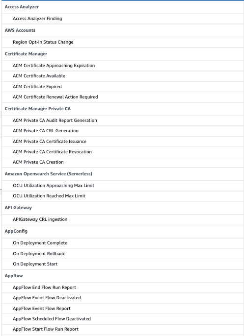
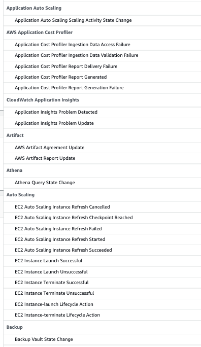
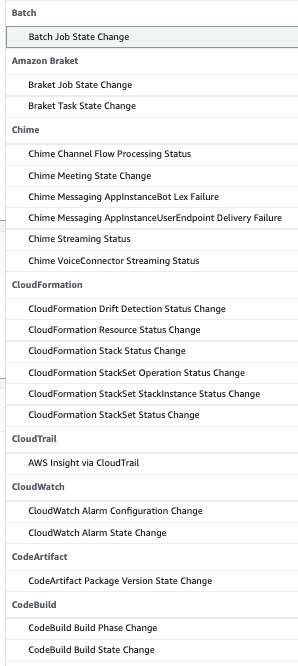
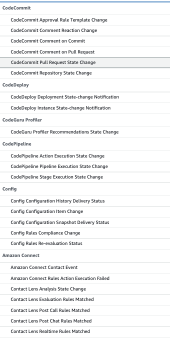
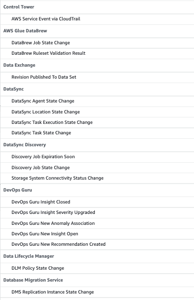
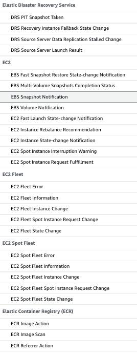
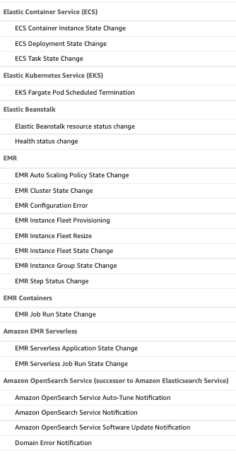
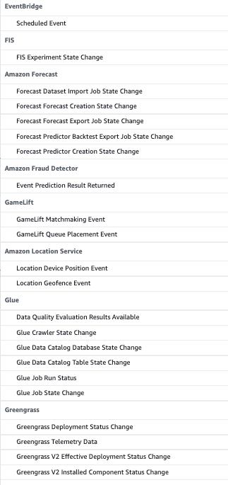
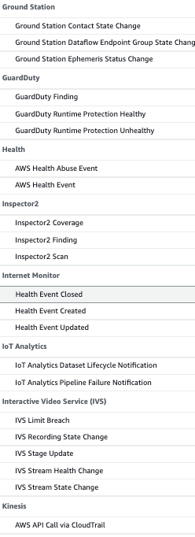
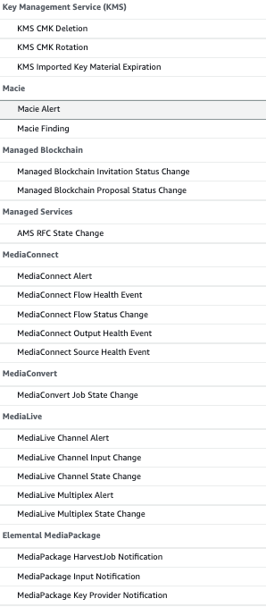
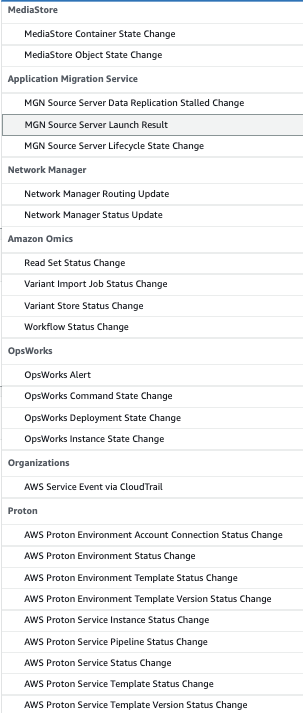
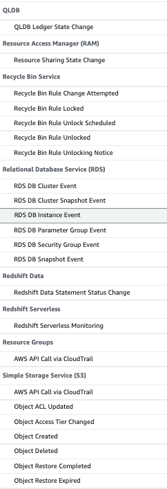
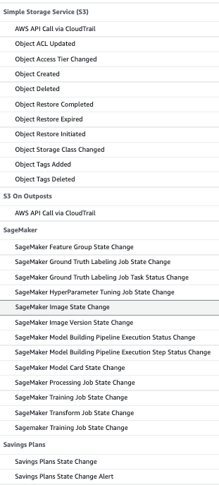
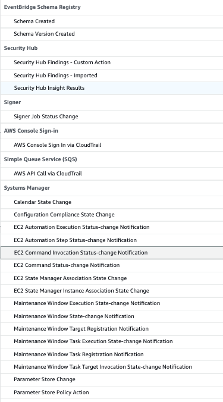
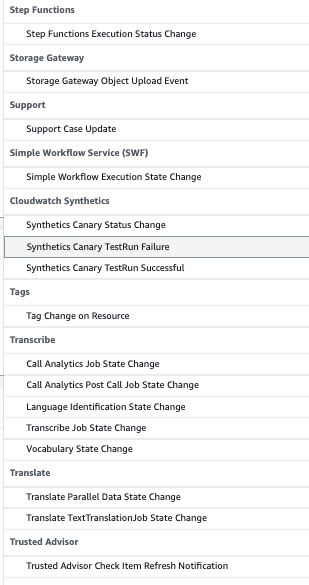
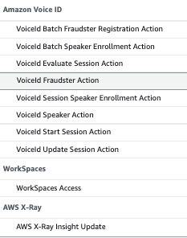
